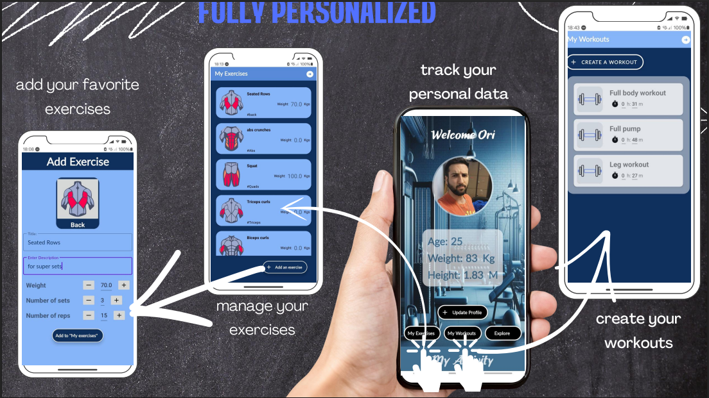
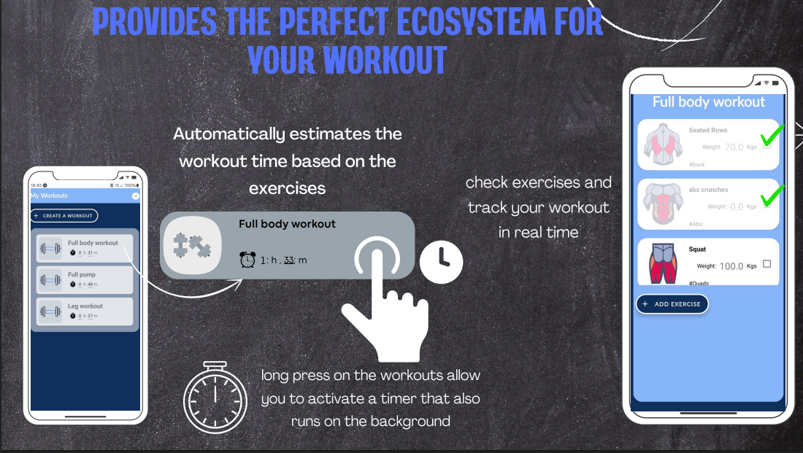
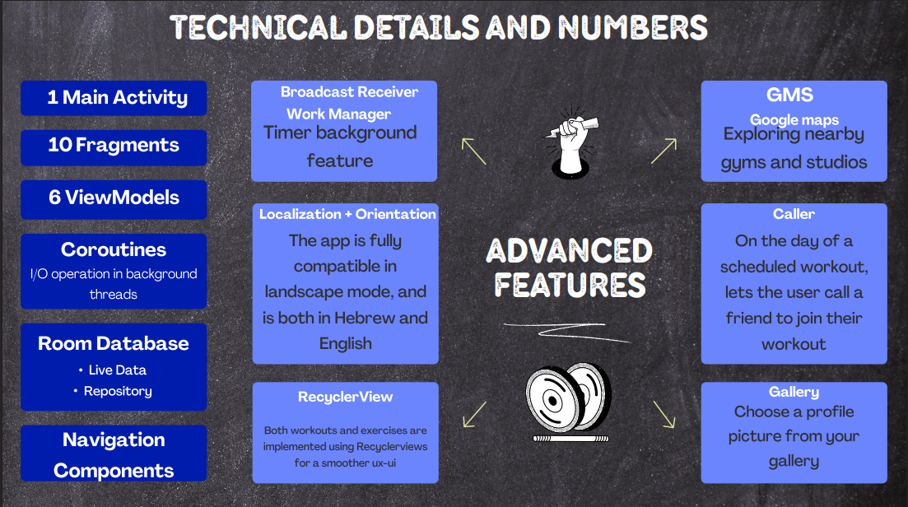
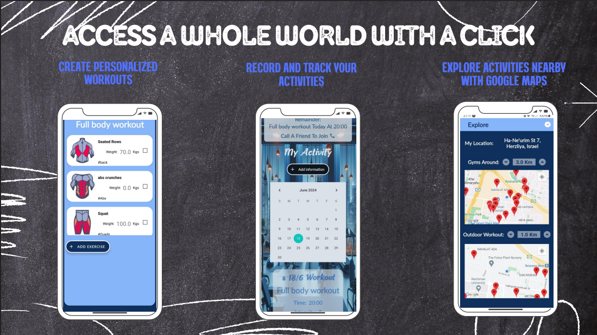

# FitIt - Kotlin Fitness Tracking App

📱 **FitIt** is a Kotlin-based Android application designed to help users effortlessly **track their workouts and fitness progress**. Whether you're at the gym, playing sports, or following a custom routine — FitIt gives you the tools to monitor your activity and stay motivated.

---

## 🚀 Features

- 🏃 **Activity Logging**  
  Track your exercises, sets, reps, and weights easily.

- 🗂️ **Workout Management**  
  Create, update, and view custom workout routines.

- 📈 **Progress Visualization**  
  Analyze your training history and track performance improvements over time.

- 🌍 **Modern UI & Experience**  
  Navigate through a sleek and intuitive interface.

---

## ⚙️ Tech Stack

- **Language:** Kotlin  
- **Architecture:** MVVM (Model-View-ViewModel)  
- **Database:** Room (local database)  
- **Jetpack Components:** LiveData, ViewModel, Navigation  
- **UI Framework:** XML-based Android layouts

---

## 👥 Meet the Team

- **Ori Itzhaki** — Military fitness instructor, Tennis Instructor
- **Mathilde Benero** — Tennis instructor  
- **Or Finkelstein** — Gym enthusiast, Tennis player

---

## 📷 Screenshots

### 🏋️ Personalized Experience  
Manage exercises, track personal data, and create custom workouts.  


### ⏱️ Workout Timing & Tracking  
Estimate workout time and check off completed exercises in real-time.  


### 🔧 Technical Architecture & Features  
Detailed breakdown of architecture, components, and advanced features.  


### 🌍 Discover Nearby Activities  
Use Google Maps to explore nearby gyms and track your activities on a calendar.  


---

## 📦 Getting Started

To build and run this project locally:

1. **Clone the repository**
    ```bash
    git clone https://github.com/oriltzh/FitIt-fitness-app.git
    cd FitIt-fitness-app
    ```

2. **Open the project in Android Studio**

3. **Sync Gradle**  
   Android Studio will automatically download the dependencies.

4. **Run the App**  
   Choose a device or emulator and press ▶️ Run.

---

## 🛠 Requirements

- Android Studio (Arctic Fox or newer)
- Android SDK 33+
- Kotlin 1.8+
- Internet connection (for map features)

---

## 🙏 Thank You

Thank you for checking out our project!  
We hope **FitIt** helps make your fitness journey more efficient and enjoyable 💪
